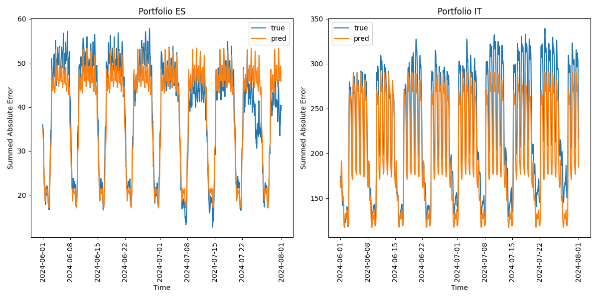

# Competition: DATATHON 2025 - ETH Zürich
**Challenge:** ALPIQ Challenge (Predict Energy Consumption for Italy and Spain)

**Team:** Gradient Descenters

**Members:** Kevin Riehl, Alexander Faroux, Cedric Zeiter, Anja Sjöström

<table>
    <tr>
        <td></td>
    </tr>
</table>


## Prediction Results

You can find our prediction results in **data/final_submission**.

## Description

To tackle the challenge of predicting energy consumption on the market of Spain and Italy, we came up with a couple of time series predictions, and evaluation strategies that will be outlined in the following.

### Train & Test Split
To evaluate our models, we used all data from *2022-01-01 00:00:00* to *2024-05-31 23:00:00* as training data, and all data from *2024-06-01 00:00:00* to *2024-07-31 23:00:00* as testing data.
We chose to do so, as not all companies where available for long time horizons.

### Models
First, we developed baseline models that serve as a benchmark, where *Hourly Mean 7* performed best.
- Mean (the average across the whole available data)
- Hourly Mean (the average of every hour within a day)
- Hourly Mean 7 (the average of every hour within a week)

Next, we tried two approaches based on Machine Learning.
- Hybrid approaches, where we try to explain residuals of *Hourly Mean 7* with machine learning models.
- Complete approaches, where we learn from the time series directly with machine learning models.
  - Gradien Boosting
  - Random Forest

While the hybrid approaches resulted in a performance gain, the complete approaches outperformed consistently.

### Prioritization
Not all predictions will count equally important into the final evaluation score.
This is, why we analysed which customers consume most of the total energy in a region, and focus on higher predictions for their prediction accuracy.
As the region portfolio *ES* (Spain) weighted more importantly and has less customers than the region portfolio *IT* (Italy) which had much more customers, we focussed on optimizing spanish customers with high consumption profiles.

For each customer, we trained different models, and finally chose predictions from those that consistently outperformed.
Due to time constrains, we focussed on chooseing best models for Spanish companies, while for all others we chose *Gradient Boosting* as a default model.

## Repository & Installation

To install all necessary packages our our Python implementation simply run:
```
pip install -r requirements.txt
```

The structure of the repository is as follows:
```
./
├── src/
│   └── TrainingPipeline.py
├── data/
│   ├── OneDrive_2025-04-05
│   ├── msci_ES.csv
│   ├── msci_IT.csv
│   ├── oil_prices.csv
│   ├── sources.txt
│   ├── scraping_oil/
│   └── final_submission/
├── figures/
│   └── ...
└── requirements.txt
```

Additional public datasources are provided including sources that outline where they come from.